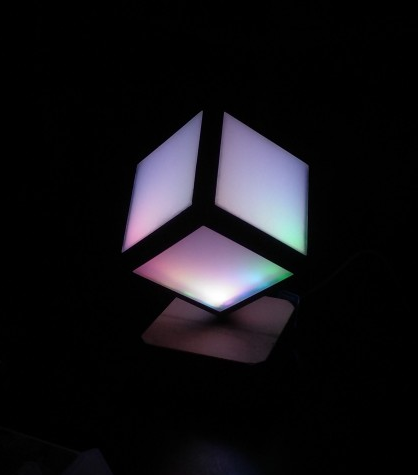

# nCube
coloful notifications on a decorative cube



## Installation

flash the firmware located in `/firmware` using `esptool` like this
```bash
esptool.py --port /dev/ttyUSB0 write_flash -fm dio 0x00000 nodemcu_ncube_20201116.bin
```

upload the lua files
```bash
npm run upload
```

upload the lfs image
```bash
alias nu="node ./node_modules/nodemcu-tool/bin/nodemcu-tool.js"
nu upload lfs.img
nu terminal
node.setpartitiontable{lfs_size = 0x20000, spiffs_addr = 0x120000, spiffs_size = 0x20000}
node.LFS.reload("lfs.img")
```

## Wifi Setup
booting for the first time will create a wifi network called `nCube_xxx` where xxx stands for your device id. Connect to the network to setup your wifi connection using the [nodemcu enduser setup](https://nodemcu.readthedocs.io/en/release/modules/enduser-setup/).

### Factory Reset
to re-enable EUS connect `D1` to `gnd` during boot.

If this does not work for some reason you can clear the wifi config manually like this

```bash
nu remove eus_params.lua
nu terminal
wifi.sta.clearconfig()
node.restart()
```

